# MatchWise: Resume-Job Matching Platform

MatchWise provides an interface for companies and candidates for matching resume and job description through NLP techniques.

## Features

### Main Menu

- Navigate to different sections like registration, login, and access multiple articles.

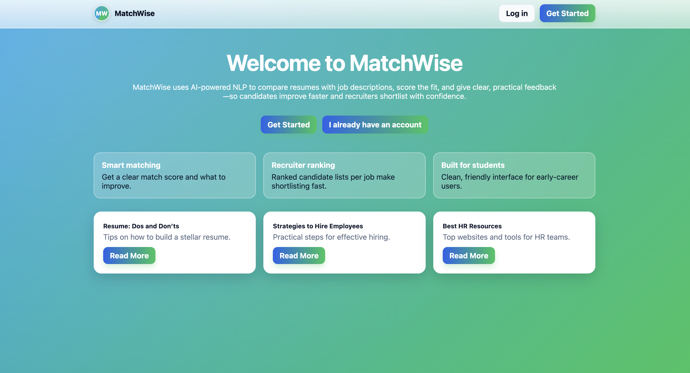

### User Authentication

- Registration for candidate and company

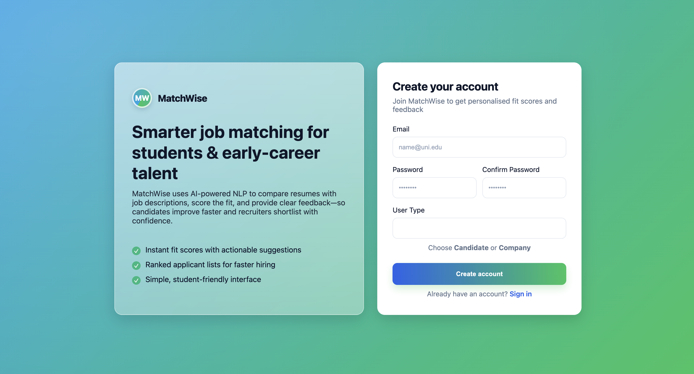

- Login

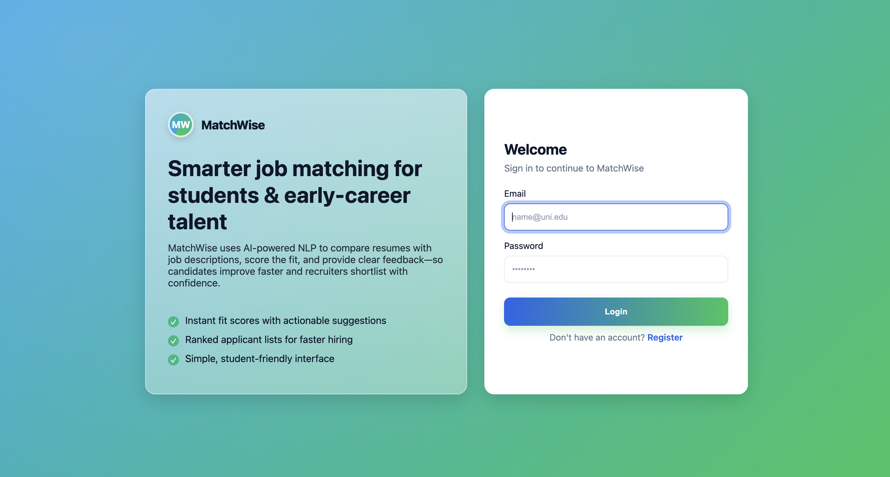

  
### For Candidates

- **Resume Upload:**

  - After logging in, candidates can easily upload their resumes in PDF format.
  
  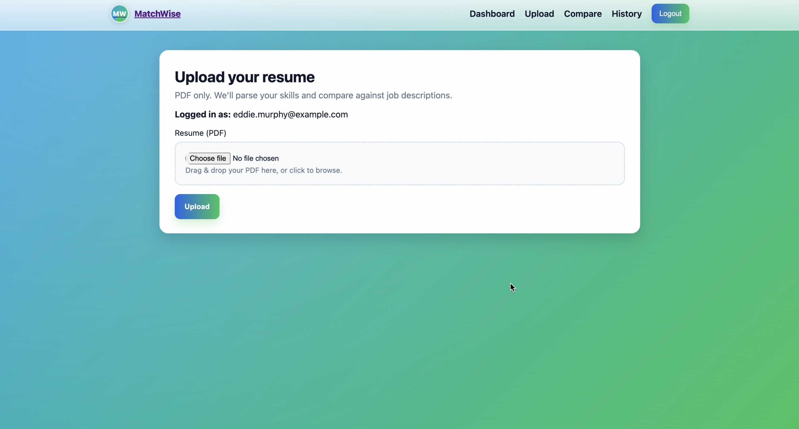

- **Job description to match:**

  - Candidate paste a job description to be matched. Select one of their resumes from the drop-down menu.
  
  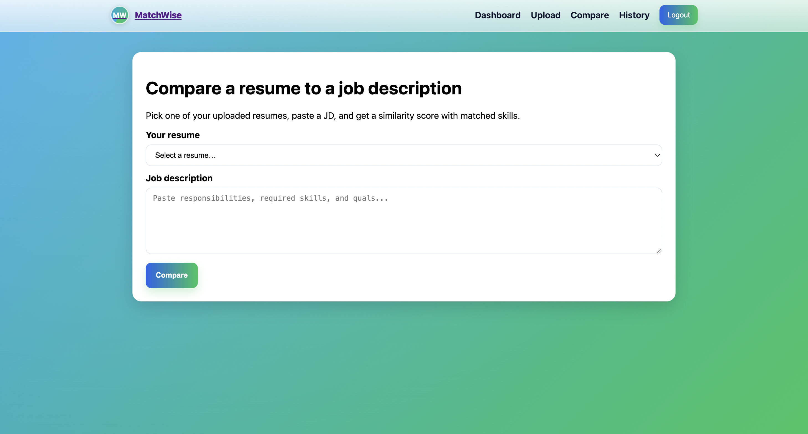

- **Matching Results:**

  - Skills, similarity score and success rate displayed.
  
  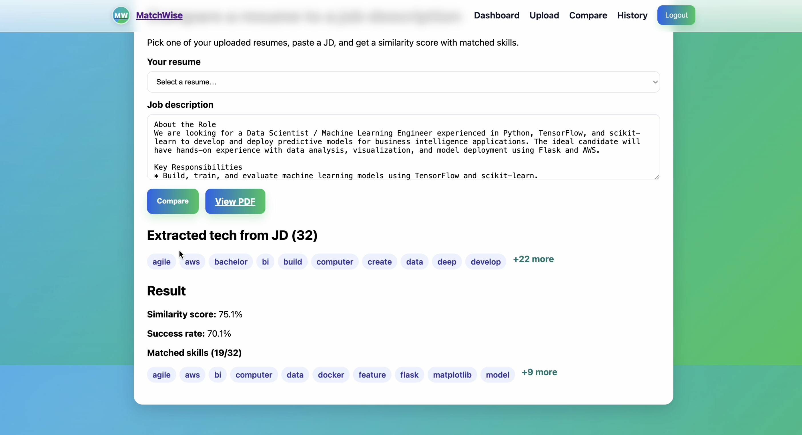

- **View History:**

  - Display the history list of all comparison results.
  
  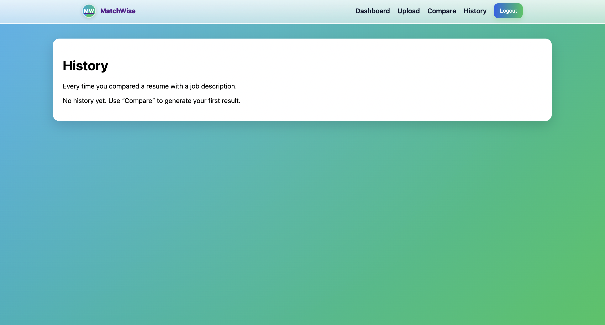

  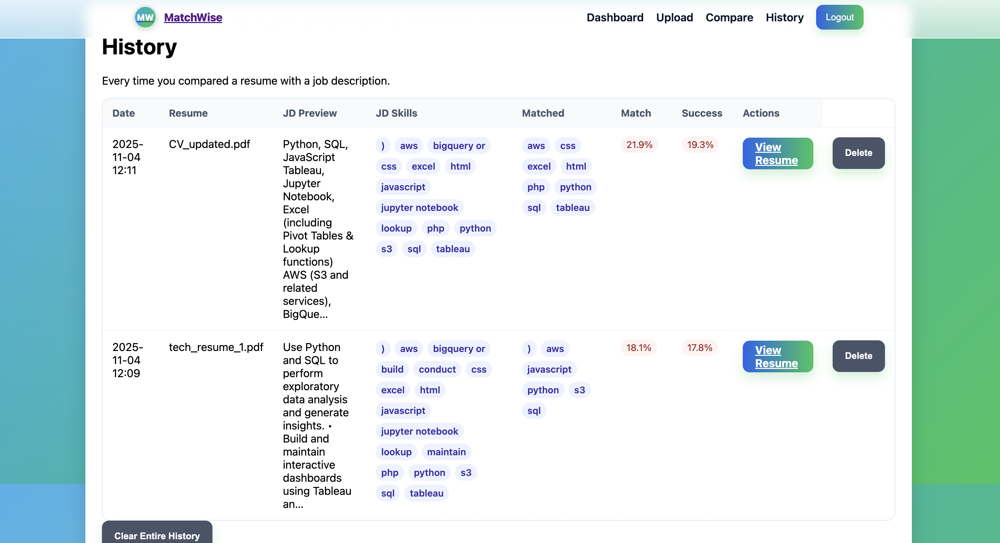

### For Companies

- **Job Description Entry:**
  - Companies can enter job descriptions to find the best matching resumes after logging in.
  
  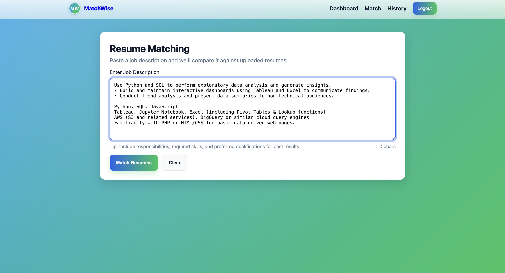

- **Resume Matching:**
  - The system extracts technical keywords from job descriptions, matching them with skills listed in candidates' resumes stored in MongoDB. Candidates with the highest overlap of skills are listed in descending order. Companies can then view and download the resumes of matched candidates.

**Example**

- User with most overlap of skills is listed first.

  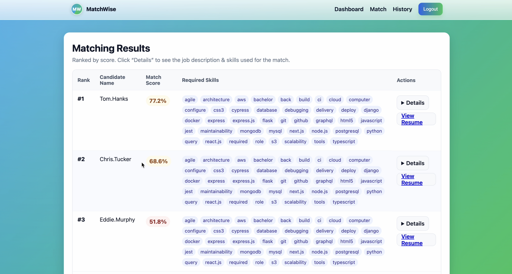

- **View History:**

  - Display match history including top 3 candidates and options to re-run and delete records.
  
  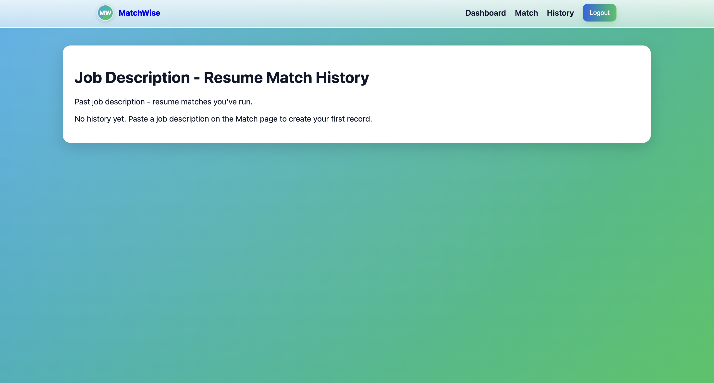

  

## Tech Stack
- **Back-End:**
  - Flask: Python-based micro web framework used to serve the application.
  - MongoDB: NoSQL database used to store user data and resumes.
  - SpaCy: Library for advanced Natural Language Processing used to fine tune current base model so that it can extract keywords from job descriptions.

- **Front-End:**
  - HTML: Markup language used for structuring and presenting content.
  - CSS: Style-sheet language used for describing the look and formatting of the document.

